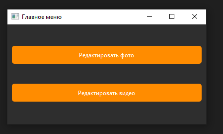
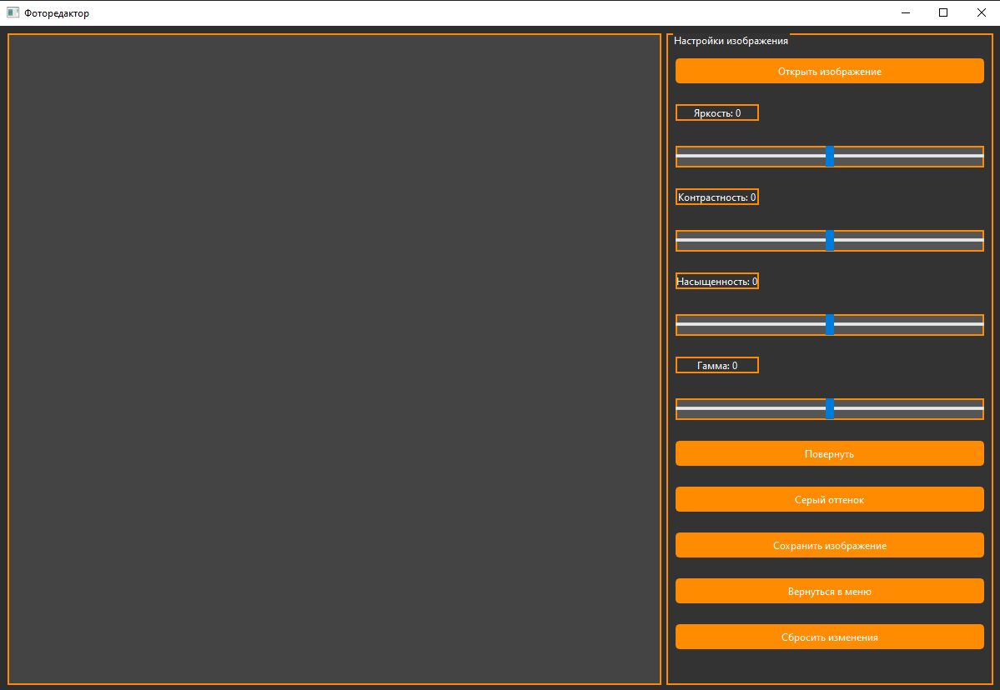
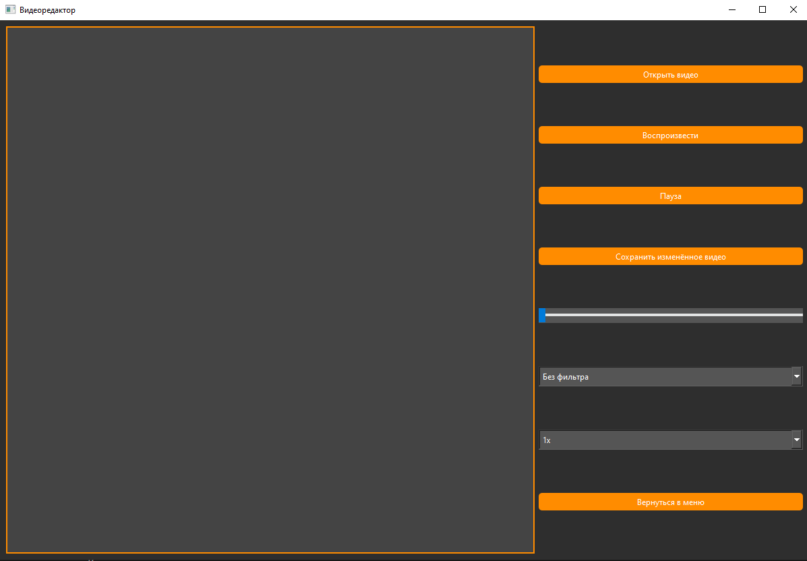

# PhotoEditorP



## Description

**PhotoEditorP** is an experimental Python application designed to explore how Python can be used to build desktop photo and video editing tools. It leverages **PyQt6** for the graphical interface and **OpenCV** for real-time image processing. The app includes both photo and video editing modes with intuitive UI components.

This project is primarily a **learning experiment** to better understand Python's capabilities in the field of multimedia and GUI development.

## Features

- **Photo Editor**
  - Rotate, resize images
  - Adjust brightness, contrast, saturation
  - Apply filters

- **Video Editor**
  - Basic playback and frame navigation
  - Changing video speed
  - Apply filters

- **Modern UI**
  - Built using PyQt6 with grouped controls and real-time previews

## Screenshots

### 📌 Main Menu


### 🖼️ Photo Editor


### 🎬 Video Editor


## Technologies Used

- Python
- PyQt6
- OpenCV
- NumPy
- moviepy (for future video editing features)

## Installation

```bash
git clone https://github.com/nikvisher/PhotoEditorPy.git
cd PhotoEditorPy
pip install -r requirements.txt
python Photoeditor.py
```

## Project Goal

> This project is an **experiment** intended to study how Python performs in building GUI applications with real-time media processing. It’s both a proof-of-concept and a personal challenge to bring photo/video editing together in one app.

## License

[](http://www.apache.org/licenses/LICENSE-2.0)

This project is licensed under the Apache License, Version 2.0.
